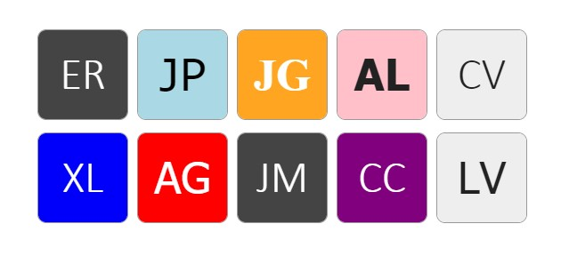

# KODITAR
Create an avatar image by taking the initials of a person's name or whatever.

## How to install?

```
npm install @kodoti/koditar
```

## Example

``` javascript
window.onload = () => {
    const image = document.createElement('img');

    // the library create a base64 image
    image.src = Koditar.render('Eduardo Rodríguez Patiño');

    document.body.append(image);
};
```


### Live Example
https://jsfiddle.net/erodriguezp105/dxhgrv6n/1/

### ⚠️Note
The avatar can't recognize between the first and the last name, take care about that.

👉 This means that the script will only take the first two words found by the text passed.

| Input | Output |
| ------------- | ------------- |
| Eduardo Rodríguez Patiño  | ER
| Juan Jose Gonzales Miranda  | JJ
| Alberto Miguel Javier Perez Lozano  | AM
| Eduardo  | ED
| AB  | AB
| A  | A

The result will be one or two letters in uppercase.

## Customize your avatar
You can customize your avatar adding extra properties to the second parameter of the function:

| Parameter name | Default | explain |
| ------------- | ------------- | ------------- |
| size  | 300  | Width and height reference.
| bgColor  | '#eee'  | Background color reference.
| color  | '#222'  | Color of the font.
| fontFamily  | 'Calibri'  | Font family which will be used.
| fontSize  | 100  | Reference to font-weight property.

### Usage
``` javascript
Koditar.render('Eduardo Rodríguez Patiño', {
    size = 300,
    bgColor = '#eee',
    color = '#222'
});
```

## Other examples


## Direct link
To avoid use webpack, gulp or something similar.

Just <a href="https://raw.githubusercontent.com/Anexsoft/koditar/main/dist/index.js">press right click here</a> and download it (it always will be the latest version).